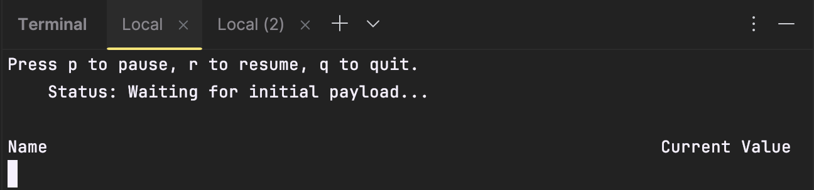

# Coleta de métricas com .NET
Contexto deste projeto: Gerenciamento das vendas de uma loja de chapéus - HatCo
## Tecnologias utilizadas
- .NET
- IDE JetBrains Rider
## Conceitos aprendidos nesse tutorial
- Importância da coleta de métricas
- Instrumentação de métricas com dotnet counters
- Injeção de dependencias

## 1. Criar métrica personalizada
Pré-requisitos: 
  - IDE para desenvolvimento em .NET
  - SDK do .NET Core 6 ou uma versão posterior
### 1. Criar console app
- Criar console app através da IDE utilizada
- Fazer referência ao pacote NuGet System.Diagnostics.DiagnosticSource no Project

### 2. Definir coleta de medida
- Definir coleta da quantidade de chapéus vendidos, através da utilização do "CreateCounter" para criar um instrumento do Contador.

-> Essa medida pode ser usada na definição de várias métricas, como o número total de chapéus vendidos ou chapéus vendidos/segundo.

### 3. Exibir a nova métrica
- Instalar a a ferramenta "dotnet-counters"

- Rodar o app:
-     > dotnet run
- Utilizar contadores de dotnet para monitorar o novo contador:
-     > dotnet-counters monitor -n CustomMetric --counters HatCo.Store
-> É esperado que sejam adicionados 4 chapéus por segundo no contador, e ele vai incrementando automaticamente. Ou seja, é simulado que estivessem sendo vendidos 4 chapeus por segundo.

## 2. Obter um Medidor por meio de Injeção de dependências
Neste exemplo, o objetivo é fazer a coleta da mesma métrica do [ex 1](#1-criar-métrica-personalizada), mas de uma forma mais otimizada, através de injeção de dependencia. Dessa forma, o medidor será tratado como um serviço isolado, facilitando, por exemplo, a realização de testes e de manutenção de código.
### 1. Primeiro, vamos criar um novo Web App no Rider:

### 2. Criar classe HatCoMetrics com 0 Counter
- Criar classe HatCoMetrics pra fazer a coleta da metrica (com o Counter, igual no exemplo 1) de quantidade de chapeus vendidos.

### 3. Setup do Program.cs
- Definir um tipo para armazenar os instrumentos

- Registrar o tipo com o contêiner de injeção de dependencia:
-     var builder = WebApplication.CreateBuilder(args);
        builder.Services.AddSingleton<HatCoMetrics>();
- Expor a contagem de chapéus vendidos com um método POST, que poderia ser utilizado integrado a um site de vendas, por exemplo, que vai atualizando a quantidade de itens vendidos a cada compra:
-     app.MapPost("/complete-sale", ([FromBody] SaleModel model, HatCoMetrics metrics) =>
        {
            metrics.HatsSold(model.QuantitySold);
        })
        .WithName("CreateCompleteSale")
        .WithOpenApi();
### 4. Rodar a aplicação com "dotnet run":

### 5. Acessar a aplicação em "http://localhost:5252", em um navegador:

### 5. Acessar o contador
- Fazer todo o setup do dotnet-counters (igual no [exemplo 1](#3-exibir-a-nova-métrica))
- Acessar o contador definido, através do terminal

### 7. Testar adicionar 1 chapeu ao contador pelo swagger

-> chapeu adicionado ao contador com sucesso:

