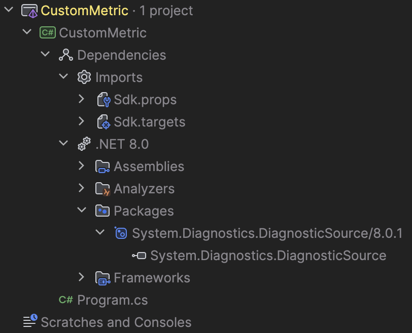

# Coleta de métricas com .NET
## Tecnologias
- .NET;
- IDE JetBrains Rider;
## Conceitos aprendidos
- Importancia das métricas
- Métricas personalizadas
- Instrumentação de métricas
- Injeção de dependencias
## 1. Passo a passo: Criar métrica personalizada
Pré-requisitos: 
  - IDE para desenvolvimento em .NET
  - SDK do .NET Core 6 ou uma versão posterior
Contexto: projeto de venda de chapéus.
### 1. Criar console app
- Criar console app através da IDE utilizada
- Fazer referência ao pacote NuGet System.Diagnostics.DiagnosticSource no Project

### 2. Definir coleta de medida
- Definir coleta da quantidade de chapéus vendidos, através da utilização do "CreateCounter" para criar um instrumento do Contador.

-> Essa medida pode ser usada na definição de várias métricas, como o número total de chapéus vendidos ou chapéus vendidos/segundo.

### 3. Exibir a nova métrica
- Instalar a a ferramenta "dotnet-counters"

- Rodar o app:
-     > dotnet run
- Utilizar contadores de dotnet para monitorar o novo contador:
-     > dotnet-counters monitor -n CustomMetric --counters HatCo.Store
-> É esperado que sejam adicionados 4 chapéus por segundo no contador, e ele vai incrementando automaticamente. Ou seja, é simulado que estivessem sendo vendidos 4 chapeus por segundo.

## 2. Obter um Medidor por meio da injeção de dependência
1. Criar Web App

2. Definir um tipo para armazenar os instrumentos e registrar o tipo com o contêiner de DI

3. Criar classe HatCoMetrics pra fazer a coleta da metrica (com o Counter, igual no exemplo 1) de quantidade de chapeus vendidos.

4. Rodar a aplicação e acessar no navegador

5. Fazer todo o setut do dotnet-counters (igual no exemplo 1)

7. Testar adicionar 1 chapeu ao contador pelo swagger

-> chapeu adicionado ao contador com sucesso:

